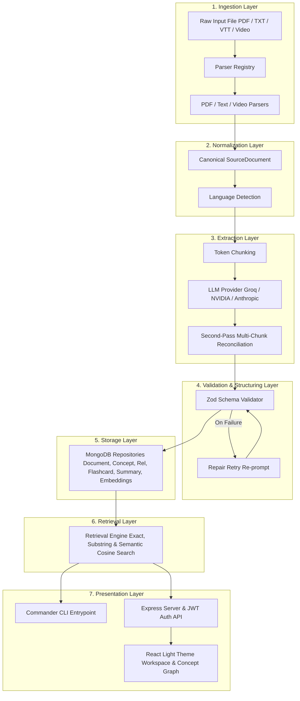

# SynthLearn — AI-Powered Learning Intelligence Platform

<p align="center">
  
</p>

**SynthLearn** is an AI-powered platform for ingesting educational content from multiple sources (PDFs, plain-text transcripts, VTT subtitle tracks, and video/audio transcripts), normalizing input text, extracting key learning concepts and directed relationships via LLM provider abstraction, and generating structured learning experiences including summaries, flashcards, concept graphs, and topological learning paths backed by MongoDB storage, JWT authentication, and vector embedding retrieval.

---

## 1. Architecture Overview

SynthLearn follows a strict, unidirectional layer architecture with decoupled responsibilities and zero circular dependencies:



See [artifacts/ARCHITECTURE.md](artifacts/ARCHITECTURE.md) for full architectural details, layer boundaries, and execution sequences.

---

## 2. Project Highlights

- **SynthLearn Branding & Enterprise SaaS UI**: Modern Light Theme design system inspired by Linear, Notion, and Vercel Dashboard with Command Palette (`Cmd/Ctrl + K`), full sidebar navigation, document workspace, study decks, multi-format summaries, and analytics.
- **Production-Ready JWT Authentication**: Custom email/password authentication with bcrypt hashing, access tokens, persistent refresh token rotation, Nodemailer SMTP verification/reset emails, and protected routes.
- **Extensible Plugin-Based Parser Registry**: Supports multiple file types (PDF, Plain Text, Markdown, VTT Subtitles, Audio/Video sidecar transcripts).
- **Provider-Agnostic LLM Abstraction**: Swappable between Groq API (`llama-3.3-70b-versatile`), NVIDIA NIM (`meta/llama-3.3-70b-instruct`), and Anthropic Claude via `.env` configuration.
- **Robust Zod Schema Validation & Repair Retry**: Validates raw LLM JSON responses against strict schemas. Automatically triggers a targeted repair retry prompt upon malformed JSON.
- **Cross-Chunk & Cross-Document Deduplication**: Performs second-pass multi-chunk LLM reconciliation for long documents and cross-document concept deduplication via lowercased `canonical_name` matching.
- **Semantic Vector Search Fallback**: Generates 128-dimensional n-gram TF-IDF embeddings saved in `concept_embeddings`, enabling cosine-similarity nearest-neighbor retrieval.
- **Topological Learning Path Generation**: Computes optimal step-by-step learning sequences from prerequisite concept relationship edges using Kahn's topological sort algorithm.

---

## 3. Technical Stack

- **Runtime & Language:** Node.js + TypeScript (strict mode)
- **CLI Framework:** Commander
- **Web Backend:** Express.js + JWT Authentication + Nodemailer
- **Web Frontend:** React + TypeScript (SynthLearn Light Theme)
- **Database:** MongoDB (via `mongoose` with schema validation & indexes)
- **Validation:** Zod
- **PDF Parsing:** `pdf-parse`
- **LLM Providers:** Groq API (`llama-3.3-70b-versatile`) & NVIDIA NIM API (`meta/llama-3.3-70b-instruct`)
- **Icons:** `lucide-react`

---

## 4. Prerequisites & Environment Setup

### Prerequisites
- Node.js v18.0.0 or higher
- npm v9.0.0 or higher
- MongoDB instance running locally (`mongodb://localhost:27017`) or cloud URI (`MONGODB_URI`)

### Environment Setup

1. **Clone Repository & Install Dependencies:**
   ```bash
   git clone https://github.com/nikhilkumarjain09/Multi-Source-Learning-Content-Ingestion-Structured-Output-Generation.git
   cd Multi-Source-Learning-Content-Ingestion-Structured-Output-Generation
   npm install
   ```

2. **Configure Environment Variables:**
   Copy the example environment configuration:
   ```bash
   cp .env.example .env
   ```
   Open `.env` and set your preferred LLM provider, JWT secrets, and MongoDB connection URI:
   ```env
   LLM_PROVIDER=groq
   GROQ_API_KEY=your_actual_groq_api_key_here
   GROQ_MODEL=llama-3.3-70b-versatile

   MONGODB_URI=mongodb://localhost:27017/learning_ingestion
   JWT_SECRET=synthlearn_super_secret_access_key_2026
   JWT_REFRESH_SECRET=synthlearn_super_secret_refresh_key_2026
   ```

3. **Verify Database Connection:**
   ```bash
   npm run db:init
   ```

---

## 5. CLI Usage & Examples

The CLI provides demo-safe, end-to-end access to the pipeline.

### Command Help
```bash
npm run cli -- --help
```

### 1. Ingest Learning Files (`ingest <filePath>`)
Ingests a document, normalizes text, extracts concepts via LLM, generates flashcards/summaries/embeddings, and persists records to MongoDB:
```bash
# Ingest sample text transcript
npm run cli -- ingest seed-data/transcripts/machine_learning_intro.txt

# Ingest sample PDF file
npm run cli -- ingest seed-data/pdfs/neural_networks.pdf

# Ingest sample VTT video transcript file
npm run cli -- ingest seed-data/videos/computer_vision_lecture.mp4
```

### 2. List Stored Topics (`list-topics`)
Lists all distinct concept names stored in the database:
```bash
npm run cli -- list-topics
```

### 3. Export Topic Flashcards (`export <topic> --format json|csv`)
Exports flashcards for a specific topic to JSON or CSV format:
```bash
# Export flashcards to JSON format
npm run cli -- export "Machine Learning" --format json

# Export flashcards to CSV format
npm run cli -- export "Machine Learning" --format csv
```

---

## 6. Web Application Execution

Start the Express API server and Web UI:
```bash
# Build TypeScript project & Vite React frontend
npm run build

# Launch Server
npm run server
```
Navigate to `http://localhost:3000` in your browser to access **SynthLearn**.

---

## 7. Verification & Test Suite

Run automated unit and integration tests:
```bash
npm run test
```

---

## 8. Project Documentation Index

- [artifacts/REQUIREMENTS.md](artifacts/REQUIREMENTS.md) — Functional and non-functional requirements.
- [artifacts/SETTINGS.md](artifacts/SETTINGS.md) — Project conventions and tech stack constraints.
- [artifacts/ARCHITECTURE.md](artifacts/ARCHITECTURE.md) — System architecture, module boundaries, and scaling strategy.
- [artifacts/DATABASE.md](artifacts/DATABASE.md) — MongoDB schemas and index definitions.
- [artifacts/API.md](artifacts/API.md) — CLI and Express Web API specifications.
- [artifacts/DESIGN_SYSTEM_V2.md](artifacts/DESIGN_SYSTEM_V2.md) — SynthLearn Web UI design tokens, color palette, and component specifications.
- [artifacts/TESTING.md](artifacts/TESTING.md) — Test strategy and pre-demo verification checklist.
