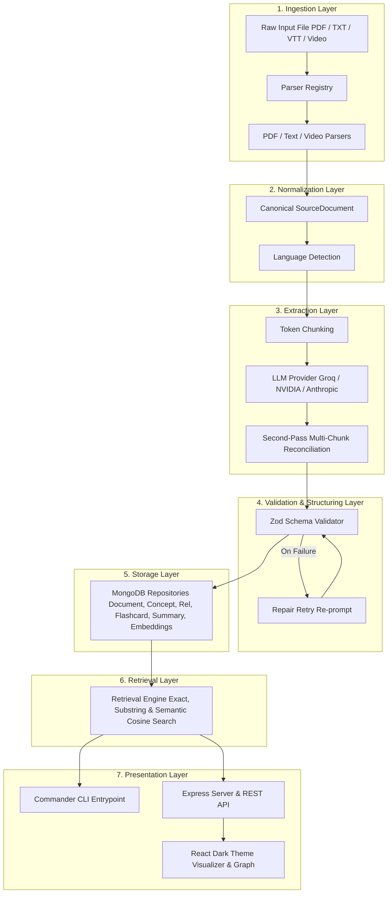

# Multi-Source Learning Content Ingestion & Structured Output Generation

A robust, production-grade system designed to ingest educational content (PDFs, plain-text transcripts, VTT subtitle tracks, video/audio transcripts), normalize input text, extract key learning concepts and directed relationships via LLM provider abstraction, and generate structured outputs (flashcards, summaries, topological learning paths, and interactive SVG concept graphs) backed by MongoDB (Mongoose) storage and vector embedding retrieval.

---

## 1. Architecture Overview

The system follows a strict, unidirectional layer architecture with decoupled responsibilities and zero circular dependencies:



See [artifacts/ARCHITECTURE.md](artifacts/ARCHITECTURE.md) for full architectural details, layer boundaries, and execution sequences.

---

## 2. Project Highlights

- **Extensible Plugin-Based Parser Registry**: Supports multiple file types (PDF, Plain Text, Markdown, VTT Subtitles, Audio/Video sidecar transcripts). Adding new format support requires only implementing the `Parser` interface and registering it—zero changes to orchestrator or downstream layers.
- **Provider-Agnostic LLM Abstraction**: Swappable between Groq API (`llama-3.3-70b-versatile`), NVIDIA NIM (`meta/llama-3.3-70b-instruct`), and Anthropic Claude via `.env` configuration.
- **Robust Zod Schema Validation & Repair Retry**: Validates raw LLM JSON responses against strict schemas. Automatically triggers a targeted repair retry prompt upon malformed JSON before raising typed errors—preventing silent drops.
- **Cross-Chunk & Cross-Document Deduplication**: Performs second-pass multi-chunk LLM reconciliation for long documents and cross-document concept deduplication via lowercased `canonical_name` matching.
- **Semantic Vector Search Fallback**: Generates 128-dimensional n-gram TF-IDF embeddings saved in `concept_embeddings`, enabling cosine-similarity nearest-neighbor retrieval when exact string match returns no results.
- **Topological Learning Path Generation**: Computes optimal step-by-step learning sequences from prerequisite concept relationship edges using Kahn's topological sort algorithm.
- **Interactive SVG Knowledge Graph**: Web UI features an interactive SVG canvas with smooth pan/zoom, node click-to-expand detail panel, and color-coded relationship edge legends.

---

## 3. Technical Stack

- **Runtime & Language:** Node.js + TypeScript (strict mode)
- **CLI Framework:** Commander
- **Web Backend:** Express.js
- **Web Frontend:** React + TypeScript (Dark Theme)
- **Database:** MongoDB (via `mongoose` with schema validation & indexes)
- **Validation:** Zod
- **PDF Parsing:** `pdf-parse`
- **LLM Providers:** Groq API (`llama-3.3-70b-versatile`) & NVIDIA NIM API (`meta/llama-3.3-70b-instruct`)
- **Icons:** `lucide-react`

---

## 4. Prerequisites & Environment Setup

### Prerequisites
- Node.js v18.0.0 or higher
- npm v9.0.0 or higher
- MongoDB instance running locally (`mongodb://localhost:27017`) or cloud URI (`MONGODB_URI`)

### Environment Setup

1. **Clone Repository & Install Dependencies:**
   ```bash
   git clone https://github.com/nikhilkumarjain09/Multi-Source-Learning-Content-Ingestion-Structured-Output-Generation.git
   cd Multi-Source-Learning-Content-Ingestion-Structured-Output-Generation
   npm install
   ```

2. **Configure Environment Variables:**
   Copy the example environment configuration:
   ```bash
   cp .env.example .env
   ```
   Open `.env` and set your preferred LLM provider, API key, and MongoDB connection URI:
   ```env
   LLM_PROVIDER=groq
   GROQ_API_KEY=your_actual_groq_api_key_here
   GROQ_MODEL=llama-3.3-70b-versatile

   MONGODB_URI=mongodb://localhost:27017/learning_ingestion

   # Alternative Provider: NVIDIA NIM
   # LLM_PROVIDER=nvidia
   # NVIDIA_API_KEY=your_actual_nvidia_api_key_here
   # NVIDIA_MODEL=meta/llama-3.3-70b-instruct
   ```

3. **Verify MongoDB Connection:**
   ```bash
   npm run db:init
   ```

---

## 5. CLI Usage & Examples

The CLI provides demo-safe, end-to-end access to the pipeline.

### Command Help
```bash
npm run cli -- --help
```

### 1. Ingest Learning Files (`ingest <filePath>`)
Ingests a document, normalizes text, extracts concepts via LLM, generates flashcards/summaries/embeddings, and persists records to SQLite:
```bash
# Ingest sample text transcript
npm run cli -- ingest seed-data/transcripts/machine_learning_intro.txt

# Ingest sample PDF file
npm run cli -- ingest seed-data/pdfs/neural_networks.pdf

# Ingest sample VTT video transcript file
npm run cli -- ingest seed-data/transcripts/lecture_video.vtt
```

### 2. List Stored Topics (`list-topics`)
Lists all distinct concept names stored in the database:
```bash
npm run cli -- list-topics
```

### 3. Export Topic Flashcards (`export <topic> --format json|csv`)
Exports flashcards for a specific topic to JSON or CSV format:
```bash
# Export flashcards to JSON format
npm run cli -- export "Machine Learning" --format json

# Export flashcards to CSV format
npm run cli -- export "Machine Learning" --format csv
```

### 4. Generate Topological Learning Path (`learning-path <topic>`)
Generates an ordered step-by-step learning sequence respecting prerequisite dependencies:
```bash
npm run cli -- learning-path "Artificial Intelligence"
```

---

## 6. Web UI & Express Server Execution

Start the Express API server and Web UI:
```bash
# Build TypeScript project & Vite React frontend
npm run build
npx vite build --prefix web/client

# Launch Server
npm run server
```
Navigate to `http://localhost:3000` in your browser.

### Web UI Features:
- **File Upload:** Single dropzone control with inline progress spinner.
- **Document Summary:** Card view displaying concise summary text.
- **Interactive Concept Graph:** SVG-rendered nodes with accent coloring (`#5B8CFF`), pan/zoom controls, node click-to-expand details, and color-coded relationship edge legends (`prerequisite`, `related-to`, `part-of`).
- **Recommended Learning Path:** Ordered sequence list highlighting prerequisite dependencies for structured study.
- **Flashcard Cards & Exports:** Expandable Q&A flashcard list with instant JSON/CSV file download buttons.
- **Topic Browser:** Filterable list for browsing stored topics.

---

## 7. Verification & Test Suite

Run automated unit and integration tests:
```bash
# Run full automated test suite
npm run test
```

Or run individual test modules:
```bash
node node_modules/tsx/dist/cli.mjs tests/parserSmoke.test.ts
node node_modules/tsx/dist/cli.mjs tests/videoParser.test.ts
node node_modules/tsx/dist/cli.mjs tests/schemaValidation.test.ts
node node_modules/tsx/dist/cli.mjs tests/edgeCases.test.ts
node node_modules/tsx/dist/cli.mjs tests/crossDocumentDedupe.test.ts
node node_modules/tsx/dist/cli.mjs tests/learningPath.test.ts
node node_modules/tsx/dist/cli.mjs tests/repositoryRoundtrip.test.ts
node node_modules/tsx/dist/cli.mjs tests/retrievalByTopic.test.ts
node node_modules/tsx/dist/cli.mjs tests/webApi.test.ts
node node_modules/tsx/dist/cli.mjs tests/cliSmoke.test.ts
```

---

## 8. Scaling & Roadmap

- **Database Transition**: Replace SQLite with PostgreSQL / Supabase via isolated repository interfaces without modifying upper pipeline layers.
- **Async Job Queue**: Introduce Redis-backed BullMQ job queues for async batch file processing.
- **Parallel Chunk Extraction**: Execute chunk-level LLM extractions concurrently using worker pools.
- **Vector DB Integration**: Scale local n-gram TF-IDF embeddings to PGVector or Qdrant for large-scale semantic discovery.
- **Caching Layer**: Wrap retrieval functions in a Redis LRU cache for sub-millisecond graph query responses.

For detailed scaling specifications, see [artifacts/ARCHITECTURE.md](artifacts/ARCHITECTURE.md).

---

## 9. Project Documentation Index

- [artifacts/REQUIREMENTS.md](artifacts/REQUIREMENTS.md) — Functional and non-functional requirements single source of truth.
- [artifacts/SETTINGS.md](artifacts/SETTINGS.md) — Project conventions and tech stack constraints.
- [artifacts/ARCHITECTURE.md](artifacts/ARCHITECTURE.md) — System architecture, module boundaries, and scaling strategy.
- [artifacts/DATABASE.md](artifacts/DATABASE.md) — SQLite schema definition and indexing rules.
- [artifacts/API.md](artifacts/API.md) — CLI and Express Web API specifications.
- [artifacts/DESIGN_SYSTEM.md](artifacts/DESIGN_SYSTEM.md) — Web UI design tokens, color palette, and component specifications.
- [artifacts/TESTING.md](artifacts/TESTING.md) — Test strategy and pre-demo verification checklist.
