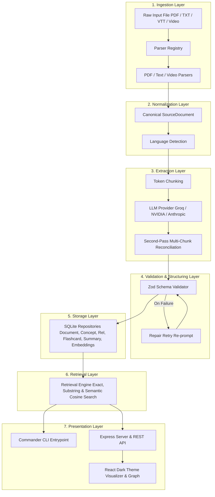

# ARCHITECTURE.md

> Re-read REQUIREMENTS.md and SETTINGS.md before implementing anything in
> this document. This file defines module boundaries — do not cross them
> even under time pressure; crossing them is what makes stretch features
> cheap to implement and maintain.

---

## 1. Pipeline Overview

The system follows a strict, unidirectional layer architecture. Each layer communicates exclusively with its direct neighbors via typed TypeScript interfaces. No layer bypasses its adjacent layer or couples directly to non-neighboring internals.



---

## 2. Layer Responsibilities

### 2.1 Ingestion Layer (`src/ingestion/`)
- Responsible ONLY for turning a file on disk into raw extracted text + basic metadata (filename, sourceType, pageCount/fileSize if applicable).
- Implements the extensible plugin pattern:

```ts
interface Parser {
  supports(filePath: string): boolean;
  parse(filePath: string): Promise<{ rawText: string; metadata: Record<string, unknown> }>;
}
```

- `registry.ts` holds an array of registered parsers. The orchestrator asks the registry "who supports this file?" and contains zero format-specific logic.
- Parsers: `pdfParser.ts`, `textTranscriptParser.ts`, `videoParser.ts` (supporting `.mp4`, `.mp3`, `.vtt`, `.srt`).

### 2.2 Normalization Layer (`src/normalization/`)
- Converts any parser's raw output into the single canonical shape:

```ts
interface SourceDocument {
  id: string;
  filename: string;
  sourceType: string;
  rawText: string;
  metadata: Record<string, unknown>;
  ingestedAt: string;
}
```

- Performs early non-English script detection (`src/ingestion/language.ts`), rejecting unsupported non-Latin documents with clear typed errors before pipeline execution.

### 2.3 Extraction Layer (`src/extraction/`)
- Takes a `SourceDocument`, chunks text if needed (token/character threshold based), and calls the LLM via the provider abstraction with a strict schema-constrained prompt.
- Prompt templates live in `src/extraction/prompts/` as separate files.
- **LLM provider abstraction** (`src/extraction/providers/`): `extract.ts` depends only on the `LLMProvider` interface. `providers/index.ts` selects between `groqProvider.ts` (default) and `nvidiaProvider.ts` based on `config.llmProvider`.
- **Multi-Chunk Reconciliation** (`mergeChunks.ts`): Performs a second-pass LLM prompt call when input is multi-chunk, consolidating duplicate or synonymous concepts across chunk boundaries.

```ts
interface ExtractionResult {
  concepts: { name: string; description: string }[];
  relationships: { from: string; to: string; type: "prerequisite" | "related-to" | "part-of" }[];
  summary: string;
}
```

### 2.4 Validation/Structuring Layer (`src/validation/`)
- Validates raw LLM JSON output against the `ExtractionResult` zod schema.
- On failure: triggers ONE repair retry (re-prompt with the error + original output asking for corrected JSON), per REQUIREMENTS.md FR2.3.
- On second failure: raises a typed `ExtractionValidationError` — never returns silent partial data.

### 2.5 Storage Layer (`src/storage/`)
- Thin repository pattern over SQLite. One repository file per entity:
  `documentRepository.ts`, `conceptRepository.ts`, `flashcardRepository.ts`,
  `relationshipRepository.ts`, `summaryRepository.ts`, `embeddingRepository.ts`.
- Implements cross-document concept deduplication via `canonical_name` matching and the `concept_documents` junction table.
- No raw SQL outside repository files.

### 2.6 Retrieval Layer (`src/retrieval/`)
- `getArtifactsByTopic(topicName)` — multi-stage retrieval:
  1. Exact match on stored concept name.
  2. Case-insensitive substring match fallback.
  3. Semantic vector search (nearest-embedding cosine similarity) fallback.
- Aggregates artifacts (concepts, flashcards, graph nodes/edges, summaries) across all documents linked to the concept.

### 2.7 Presentation Layer
- **CLI** (`src/cli/`): Commander-based CLI (`ingest`, `list-topics`, `export`, `learning-path`). Operates independently of the web server for demo safety.
- **Web UI** (`web/`): Express REST API server (`web/server/routes.ts`) exposing JSON endpoints, paired with a React frontend (`web/client/`) providing dark mode topic browsing, interactive SVG concept graph visualization (zoom, pan, click-to-expand), ordered learning paths, and flashcard cards.

---

## 3. Folder Structure

```
project-root/
├── src/
│   ├── ingestion/
│   │   ├── parsers/
│   │   │   ├── pdfParser.ts
│   │   │   ├── textTranscriptParser.ts
│   │   │   └── videoParser.ts
│   │   ├── language.ts
│   │   ├── registry.ts
│   │   └── types.ts
│   ├── normalization/
│   │   └── normalize.ts
│   ├── extraction/
│   │   ├── prompts/
│   │   │   └── extractConcepts.prompt.ts
│   │   ├── providers/
│   │   │   ├── groqProvider.ts
│   │   │   ├── nvidiaProvider.ts
│   │   │   ├── types.ts
│   │   │   └── index.ts
│   │   ├── extract.ts
│   │   ├── chunk.ts
│   │   └── mergeChunks.ts
│   ├── validation/
│   │   ├── schema.ts
│   │   └── validateExtraction.ts
│   ├── storage/
│   │   ├── db.ts
│   │   ├── documentRepository.ts
│   │   ├── conceptRepository.ts
│   │   ├── relationshipRepository.ts
│   │   ├── flashcardRepository.ts
│   │   ├── summaryRepository.ts
│   │   └── embeddingRepository.ts
│   ├── retrieval/
│   │   ├── getArtifactsByTopic.ts
│   │   └── embeddings.ts
│   ├── outputs/
│   │   ├── flashcardExport.ts
│   │   ├── graphExport.ts
│   │   └── learningPath.ts
│   ├── cli/
│   │   ├── index.ts
│   │   └── commands/
│   │       ├── ingest.ts
│   │       ├── listTopics.ts
│   │       ├── export.ts
│   │       └── learningPath.ts
│   └── shared/
│       ├── config.ts
│       └── types.ts
├── web/
│   ├── server/
│   │   └── routes.ts
│   └── client/
│       ├── src/
│       │   ├── components/
│       │   │   ├── ConceptGraph.tsx
│       │   │   ├── FlashcardList.tsx
│       │   │   ├── LearningPathPanel.tsx
│       │   │   ├── SummaryPanel.tsx
│       │   │   ├── TopicBrowser.tsx
│       │   │   └── UploadControl.tsx
│       │   └── App.tsx
│       ├── index.html
│       └── vite.config.ts
├── api/
│   └── index.ts
├── seed-data/
│   ├── pdfs/
│   └── transcripts/
├── reports/
│   └── PROJECT_DOCUMENTATION.pdf
├── tests/
├── vercel.json
├── .env.example
├── README.md
└── package.json
```

---

## 4. Running the Project

Follow this precise order of operations to run the project locally in development mode:

### 1. Installation & Environment Configuration
```bash
# Clone the repository
git clone https://github.com/nikhilkumarjain09/Multi-Source-Learning-Content-Ingestion-Structured-Output-Generation.git
cd Multi-Source-Learning-Content-Ingestion-Structured-Output-Generation

# Install backend & root dependencies
npm install

# Set up environment variables
cp .env.example .env
```
Edit `.env` to supply your API credentials:
```ini
LLM_PROVIDER=groq
GROQ_API_KEY=gsk_your_actual_key_here
GROQ_MODEL=llama-3.3-70b-versatile
```

### 2. Database Initialization
Initialize the SQLite schema (tables, foreign key constraints, indexes, junction tables, and embedding stores):
```bash
npm run db:init
```

### 3. Run CLI Pipeline (Demo / Ingestion Mode)
Ingest seed data files using the standalone CLI entrypoint:
```bash
# Ingest PDF seed file
npm run cli -- ingest seed-data/pdfs/neural_networks.pdf

# Ingest transcript seed file
npm run cli -- ingest seed-data/transcripts/machine_learning_intro.txt

# List stored topics
npm run cli -- list-topics

# Export flashcards to CSV
npm run cli -- export "Artificial Intelligence" -f csv

# Generate topological learning path
npm run cli -- learning-path "Artificial Intelligence"
```

### 4. Run Web Application Server
Build project bundles and launch the integrated Express REST API + Web UI server:
```bash
# Compile TypeScript code
npm run build

# Build React client frontend bundle
npx vite build --prefix web/client

# Launch web server (port 3000 by default)
npm run server
```
Open **`http://localhost:3000`** in your web browser.

### What a Successful End-to-End Run Looks Like:
1. **CLI**: Running `ingest` displays progress messages (`Parsing file...`, `Extracting concepts...`, `Saving to SQLite database...`) and prints a clean summary table containing the document ID, extracted concepts, relationship counts, and flashcard counts with exit code `0`.
2. **Web UI**: Uploading a file displays an inline loading spinner. Upon completion, the screen populates with the document summary, an interactive SVG concept graph with color-coded relationship edges, an ordered topological learning path, and exportable flashcard cards.

---

## 5. Scaling & Future Implementation

The system's modular architecture is designed to scale across multiple dimensions without refactoring existing domain logic:

### 1. Storage Scaling (SQLite -> PostgreSQL)
Because all database interactions are encapsulated behind repository interfaces (`conceptRepository.ts`, `documentRepository.ts`, etc.), swapping SQLite for PostgreSQL or Amazon Aurora requires zero changes to the ingestion, extraction, retrieval, or presentation layers. Only the SQL statements inside `src/storage/*.ts` need to be swapped.

### 2. Ingestion Job Queue (Async Processing)
For large-scale batch processing, file uploads can produce jobs pushed to a Redis-backed queue (e.g., BullMQ or RabbitMQ). Worker processes pull jobs, invoke `runIngestionPipeline()`, and push notifications via WebSockets or Webhooks upon completion, preventing web server request thread starvation.

### 3. Semantic Vector Search (Implemented in Stretch S4)
Topic retrieval uses a 128-dimensional local n-gram TF-IDF vector embedding engine stored in `concept_embeddings`. When exact or substring concept matching returns no results, cosine similarity scoring evaluates query vectors against all stored concept embeddings. For production scale (millions of concepts), this layer can transition to PGVector or Qdrant without altering `getArtifactsByTopic()`'s signature.

### 4. Parallelized Extraction & Chunk Execution
For large documents divided into $N$ text chunks, chunk extraction calls (`extractConceptsFromChunk`) can execute concurrently via `Promise.all()` or a bounded worker pool. The second-pass `reconcileMultiChunkExtractions` step then merges the array of chunk extraction results into a unified result.

### 5. Caching Strategy
A Redis LRU cache can wrap `getArtifactsByTopic(topicName)` and `getAllConceptNames()`. Ingest operations invalidate cached keys matching affected concept names, delivering sub-millisecond retrieval performance for frequent web UI traffic.

---

## 6. Internationalization (i18n)

### 1. Document Input & Extraction i18n
- **Script Detection**: Non-English script detection (`src/ingestion/language.ts`) flags non-Latin character distributions and returns a clear, typed `Unsupported language` error.
- **Prompt Localisation**: To support non-English documents in future versions, prompt templates (`src/extraction/prompts/`) can accept a target language parameter (e.g., `"Extract concepts in French and provide English canonical translations"`).
- **Cross-Lingual Concept Deduplication**: The concept repository can store a normalized `canonical_name_en` alongside localized concept names, allowing cross-document deduplication across documents written in different languages.

### 2. Web UI Translation Architecture
- **Dictionary Externalization**: UI strings in React components (`UploadControl.tsx`, `ConceptGraph.tsx`, `LearningPathPanel.tsx`) can be extracted into JSON translation catalogs (e.g., `locales/en.json`, `locales/es.json`).
- **i18n Context Provider**: A lightweight React i18n context or `react-i18next` hook can supply string translation functions (`t('graph.legend.prerequisite')`), defaulting to English with zero runtime overhead.
